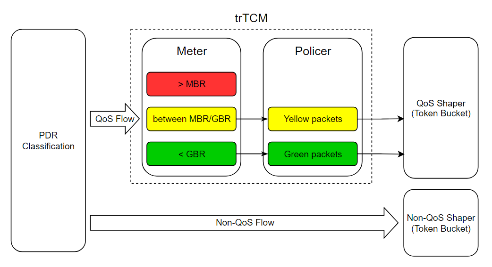
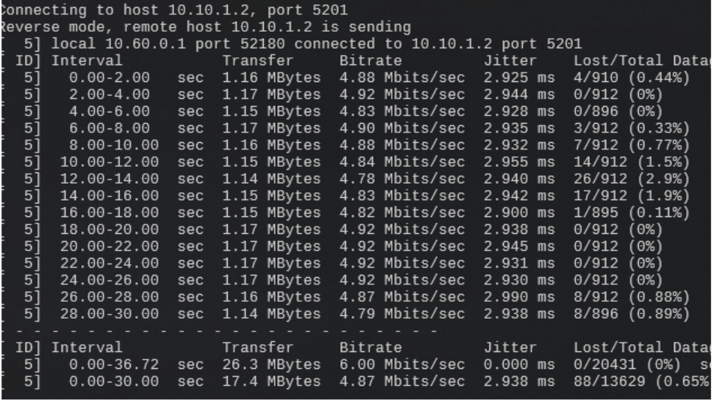
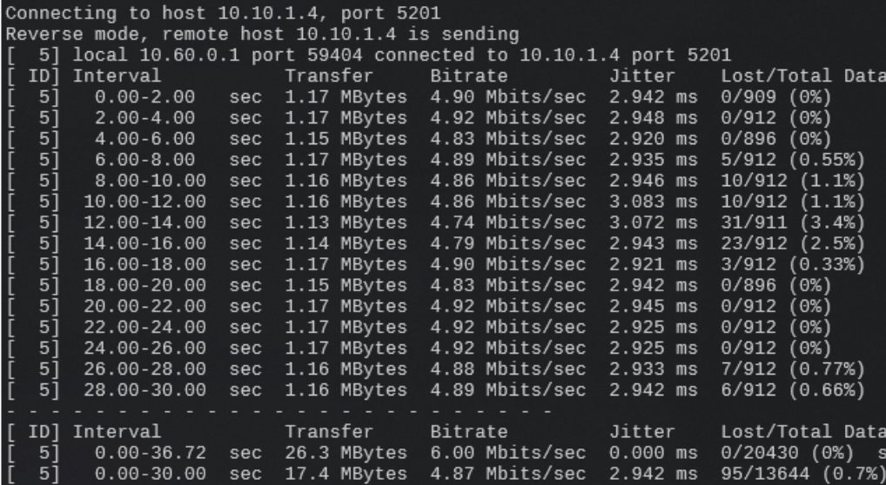

# QoS design document
This document describes the high-level QoS system design for L25GC+ and shows some experimental results.

## Introduction

The QoS in the 5G system can be considered as the below figure.


By combining the trTCM and Token Bucket algorithms, fine-grained control of network traffic is achieved, ensuring that different types of traffic receive the required bandwidth and quality of service.

## System Architecture

- **trTCM**
    - Used to implement QoS Flow traffic shaping, classifying traffic into red, yellow, and green colors based on traffic characteristics to indicate different service levels.
- **Token Bucket**
    - Used for traffic shaping by controlling the issuance and consumption of tokens to smooth traffic.

## Workflow

> This diagram illustrates the workflow of the onvm-upf used in L25GC+. The trTCM and token buckets are implemented in the packet handler to ensure quality of service.

### Packet Handler

> This diagram illustrates the workflow of the trTCM and token buckets in packet handler.
1. **PDR classification**
    - Classify packets into QoS or Non-QoS flows based on the PDR.
2. **QoS Flow Processing**
    - If the traffic belongs to a QoS flow:
        1. **trTCM**: Consists of a meter and a policer. The meter marks packets based on the QoS parameters, while the policer drops red packets that exceed the Maximum Flow Bit Rate (MFBR).
        2. **QoS Traffic Shaper**: A token bucket serves as a traffic shaper to ensure compliance with session-AMBR.
3. **Non-QoS Flow Processing**
    - If the traffic belongs to a Non-QoS flow:
        1. **Non-QoS Traffic Shaper**: A token bucket serves as a traffic shaper to ensure compliance with session-AMBR.
4. **Token Bucket Update**
    - Whether it is QoS flow or Non-QoS flow, the number of tokens in the corresponding token bucket needs to be updated after each packet is processed.
    - `QoS Token Rate =  min((GBR + (AMBR-GBR)/2) , MBR)`
    - `Non-QoS Token Rate = AMBR - QoS Token Rate`


## Experimental Results

The following section presents the experimental results obtained from implementing the QoS system. These results demonstrate the effectiveness of the trTCM and token bucket algorithms in managing network traffic and ensuring the required quality of service for different types of traffic.

### QoS Parameters
- GBR QoS Flow
    - Guaranteed Flow Bit Rate (GFBR) - DL: 2 Mbps
    - Maximum Flow Bit Rate (MFBR) - DL: 5 Mbps
- Session-AMBR: 10 Mbps
- Flow description: permit out ip form any to 10.10.1.2

### Environment
- UE IP: `10.60.0.1`
- DN IP: `10.10.1.2`, `10.10.1.4`
- Iperf3 commands
    - server
        ```
        iperf3 -s -B 10.10.1.2
        iperf3 -s -B 10.10.1.4
        ```
    - clients
        ```
        iperf3 -c 10.10.1.2 -B 10.60.0.1 -u -b 10M -R
        iperf3 -c 10.10.1.4 -B 10.60.0.1 -u -b 10M -R
        ```

### Results
The displayed results are shown below:

| QoS Flow | Non-QoS Flow |
|----------|--------------|
|  |  |

From the images, we can see that the QoS flow is limited to below 5 Mbps and the traffic is evenly distributed with the non-QoS flow.


 
